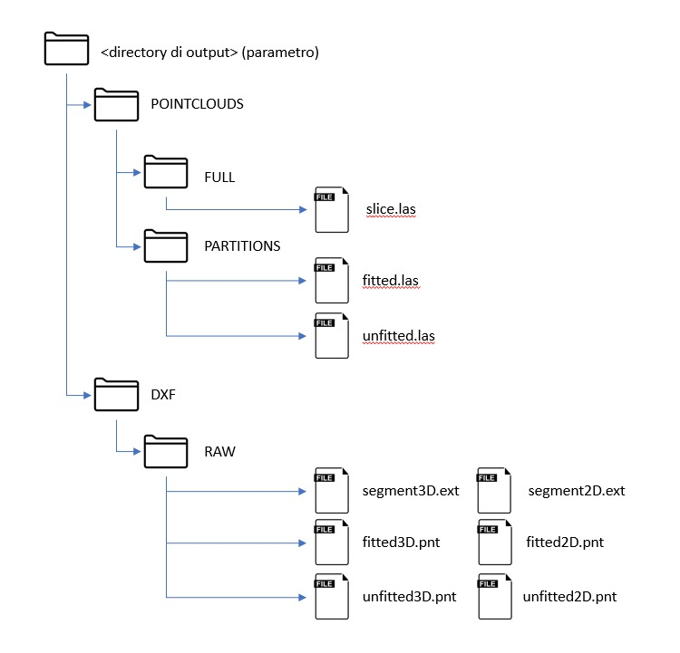

# Script Usage

## vectorize_1D.jl

Lines detection.

Detect lines in a flat point cloud, i.e. points that lies on an arbitrary plane `π` (such as floor plan), in the 3D space.
An useful parameters is the description of plane `π` since during the process it is necessary to convert 3D points to 2D coordinates.
The resulting segments and relative fitted points are stored as shown below.



```
$ julia vectorize_1D.jl -h

positional arguments:
  source                Potree directory

optional arguments:
  -p, --projectname PROJECTNAME
                        Project name
  -o, --output OUTPUT   Output folder
  --par PAR             Distance to line (type: Float64)
  --lod LOD             Level of detail. If -1, all points are taken
                        (type: Int64, default: -1)
  --failed FAILED       Number of failed before exit (type: Int64,
                        default: 100)
  --validity VALIDITY   Number of points in a line (type: Int64,
                        default: 5)
  --k K                 Number of neighbors (type: Int64, default: 10)
  --plane PLANE         a, b, c, d parameters described the plane
  -h, --help            show this help message and exit
```

Examples:

    # lines detection
    julia vectorize_1D.jl "C:/POTREE_PROJECT" -o "C:/MY_PROJS" -p "FLOOR_PLAN" --par 0.02 --plane "0 0 1 0"
